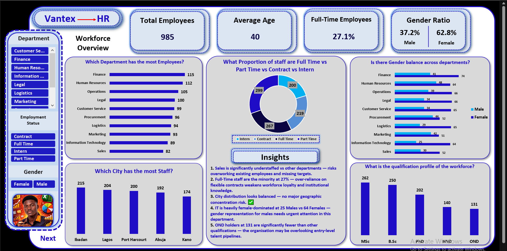
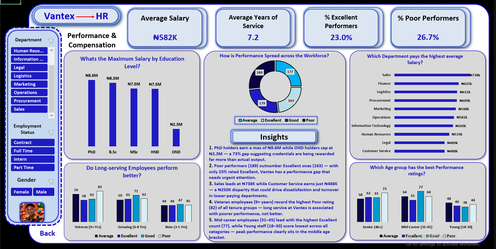

# Vantex HR — Workforce & Performance Analytics Dashboard

A 2-dashboard interactive Excel HR analytics report built on workforce data for Vantex, 
covering 985 employees across 10 departments and 5 cities in Nigeria. The dashboards 
answer key human resource management questions around workforce composition, gender 
balance, compensation structure, and employee performance.

---

## About This Project

This project was built as a complete end-to-end HR data analysis, transforming raw 
employee records into a clean, interactive, insight-driven Excel dashboard. It covers 
two core dimensions of HR analytics: Workforce Overview and Performance and Compensation.

---

## Dashboard Structure

| Dashboard | Focus | Key Questions Answered |
|---|---|---|
| Dashboard 1 | Workforce Overview | Department staffing, employment status, city distribution, gender balance, qualification profile |
| Dashboard 2 | Performance and Compensation | Salary by education, performance spread, department pay, tenure vs performance, age vs performance |

---

## Key Findings

**Workforce Overview**

- Sales is significantly understaffed at 82 employees compared to Finance at 115 and 
Human Resources at 112, creating overwork risk and missed revenue targets
- Full-Time staff represent only 27.1% of the workforce. Over-reliance on Contract, 
Intern, and Part-Time staff weakens workforce loyalty and institutional knowledge retention
- City distribution is balanced across Ibadan (215), Lagos (204), Port Harcourt (200), 
Abuja (192), and Kano (174), with no major geographic concentration risk
- Information Technology is heavily female-dominated at 25 Males vs 64 Females, 
indicating an urgent need for targeted male recruitment in that department
- OND holders at 131 are significantly fewer than other qualification levels, suggesting 
the organisation may be overlooking entry-level talent pipelines
  

**Performance and Compensation**

- PhD holders earn a maximum salary of N8.6M while OND holders cap at N2.3M, a 73% gap 
suggesting credentials are being rewarded far more than actual output
- Poor performers (189) outnumber Excellent performers (163), with only 23% of the 
workforce rated Excellent. Vantex has a performance gap that needs urgent attention
- Sales department leads average salary at N738K while Customer Service earns just N488K, 
a N250K disparity that could drive dissatisfaction and turnover in lower-paying departments
- Veteran employees with 9 or more years of service record the highest Poor performance 
rating across all tenure groups, meaning long service at Vantex is associated with poorer 
performance rather than better performance
- Mid-career employees aged 31 to 45 record the highest Excellent count at 77, while 
Young staff aged 18 to 30 score lowest across all categories. Peak performance clearly 
sits in the middle age bracket
 

---

## Business Questions Answered

**Workforce Overview**

1. Which department has the most employees?
2. What proportion of staff are Full-Time vs Part-Time vs Contract vs Intern?
3. Which city has the most staff?
4. Is there gender balance across departments?
5. What is the qualification profile of the workforce?
 
**Performance and Compensation**

6. What is the maximum salary by education level?
7. How is performance spread across the workforce?
8. Which department pays the highest average salary?
9. Do long-serving employees perform better?
10. Which age group has the best performance ratings?
  
---

## Dashboard Features

- 2 interactive dashboards with slicers for Department, Employment Status, and Gender
- KPI cards showing Total Employees, Average Age, Full-Time Rate, Gender Ratio, 
Average Salary, Average Years of Service, Excellent Performer Rate, and Poor Performer Rate
- Insight boxes on each dashboard summarising the 5 most important findings
- Navigation button between dashboards
- Charts include horizontal bar charts, donut charts, and clustered column charts

---

## Tools Used

- Microsoft Excel (Pivot Tables, Charts, Slicers)
- Data Cleaning and Transformation
- Dashboard Design and Data Visualisation

---

## File Contents

| File | Description |
|---|---|
| [Vantex HR Dashboard (Download)](https://github.com/obiekwe-emmanuel/vantex-hr-workforce-dashboard/blob/main/Vantex-HR%20Project.xlsm) | Interactive Excel dashboard file |

---

## Dashboard Screenshots

**Dashboard 1 - Workforce Overview**

 

**Dashboard 2 - Performance and Compensation**

 

---

## Author

**Obiekwe Emmanuel C.**
Business Analyst

---

> This dashboard was built as a portfolio project demonstrating HR analytics 
> capabilities using Microsoft Excel.
